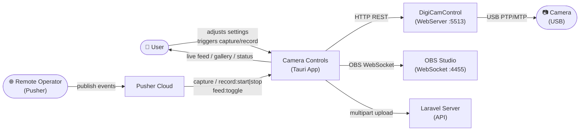
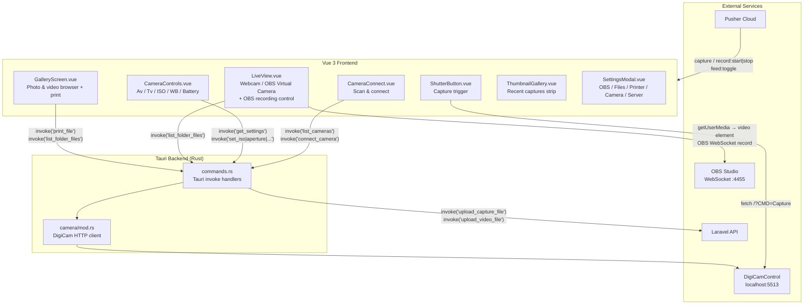
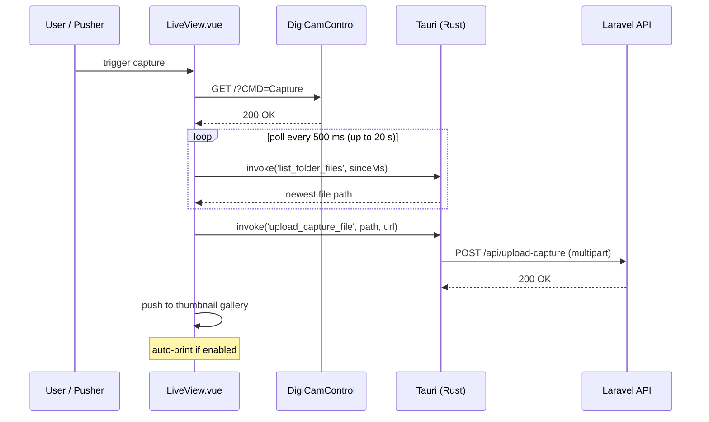
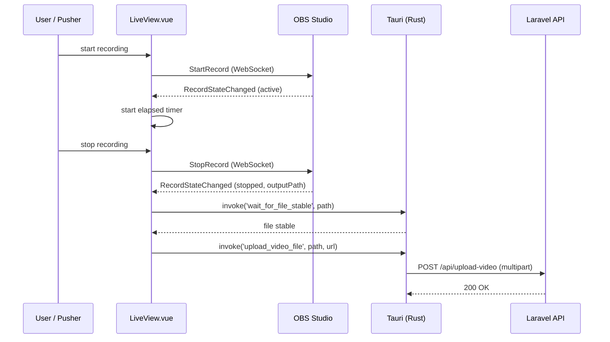
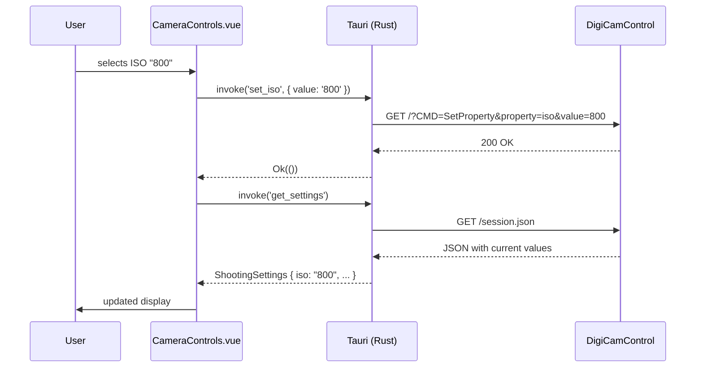

# Camera Controls

A desktop app built with **Tauri 2 + Vue 3** that remotely controls Canon/Nikon DSLR and mirrorless cameras over USB via **DigiCamControl**, integrates with **OBS Studio** for live feed and video recording, and supports remote triggering via **Pusher** — no proprietary SDK installation required.

---

## Features

### Camera Control (via DigiCamControl)
- **Camera Discovery** — scans and connects to cameras detected by DigiCamControl
- **Aperture (Av)** — live selector synced from the camera
- **Shutter Speed (Tv)** — live selector synced from the camera
- **ISO** — live selector synced from the camera
- **White Balance** — all WB modes
- **Battery indicator** — live percentage bar
- **Shutter trigger** — single full-quality capture

### Live View & Recording (via OBS)
- **Live Feed** — displays any connected webcam or OBS Virtual Camera via `getUserMedia`; auto-detects OBS Virtual Camera
- **Video Recording** — starts/stops OBS recording via OBS WebSocket; elapsed timer shown in UI
- **Frame Capture** — captures a full-quality photo from DigiCamControl during a live session

### Gallery & Print
- **Thumbnail Strip** — recent photos and videos shown in the main UI; refreshes automatically after each capture
- **Gallery Screen** — full-screen browser with **Photos** and **Videos** tabs; click any item to preview or open it
- **Print** — prints directly to a configured Windows printer (no dialog) or falls back to browser print; configurable paper size (4×6, 5×7, 4×4, Letter, A4, A5), orientation, copies, and fit mode
- **Auto-Print** — optionally prints every new photo immediately after capture

### Remote Control (via Pusher)
- **`capture` event** — triggers a photo or timed video recording remotely
- **`record:start` / `record:stop` events** — starts/stops OBS recording remotely
- **`feed:toggle` event** — toggles the live feed on/off remotely
- Pusher connection status shown in the UI

### Remote Server Upload (Laravel backend)
- Photos are automatically uploaded to a configured Laravel API endpoint after capture
- Videos are uploaded after OBS finishes writing the file (polls for stability)
- Upload URL, multipart field name, and shared secret are configurable via `.env`

### Settings Modal
Five-tab settings panel (⚙ icon in the toolbar):

| Tab | Purpose |
|-----|---------|
| **OBS** | OBS WebSocket host, port, password; auto-connects on launch |
| **Files** | Image output folder (DigiCamControl) and video output folder (OBS); auto-reads from OBS on connect |
| **Printer** | Printer selection, paper size, orientation, copies, fit mode |
| **Camera** | Connect / reconnect camera when not on main screen |
| **Server** | Override the remote Laravel server base URL |

---

## How it Works — Data Flow Diagrams

### Context Diagram (Level 0)



### Application Flow (Level 1)



### Capture & Upload Flow



### OBS Recording Flow



### Settings Change Flow



---

## Installation

---

### For End Users (Running the App)

> If you just want to use the app, follow these steps. No Rust or Node.js required.

**Step 1 — Install DigiCamControl**

1. Download from **https://digicamcontrol.com/download** and run the installer.
2. Open DigiCamControl, go to **Extra → Plugins**, and enable **WebServer**.
3. Restart DigiCamControl. The web server auto-starts on `http://localhost:5513`.
4. Connect your camera via USB and power it on.

**Step 2 — Install OBS Studio** *(required for live feed and video recording)*

1. Download from **https://obsproject.com** and install.
2. Enable **OBS WebSocket**: go to **Tools → obs-websocket Settings**, enable it, set a password (or leave blank), and note the port (default `4455`).
3. To use the OBS Virtual Camera for the live feed: **Start Virtual Camera** in OBS.

**Step 3 — Install Camera Controls**

1. Go to the [**Releases**](../../releases) page of this repository.
2. Download the latest `.msi` (Windows Installer) or `.exe` (NSIS) from the assets.
3. Run the installer and follow the prompts.
4. Launch **Camera Controls** from the Start Menu or Desktop shortcut.
5. Open ⚙ **Settings → OBS** and enter your OBS WebSocket credentials, then click **Connect**.
6. Open ⚙ **Settings → Files** and set the **Image output** folder to match DigiCamControl's capture folder.
7. Click **Scan** on the camera panel — your camera will appear if DigiCamControl is running.

> **Tip:** DigiCamControl must be running with the WebServer plugin active whenever you use this app.

---

### For Developers (Building from Source)

### Prerequisites

| Requirement | Version | Link |
|-------------|---------|------|
| Node.js | ≥ 18 | https://nodejs.org |
| Rust & Cargo | stable | https://rustup.rs |
| DigiCamControl | ≥ 2.1 | https://digicamcontrol.com |
| OBS Studio | ≥ 28 (WebSocket 5.x) | https://obsproject.com |
| WebView2 Runtime | any | Pre-installed on Windows 10/11 |

> **Note:** No Canon/Nikon SDK download is required. DigiCamControl handles all USB communication.

---

### Step 1 — Install DigiCamControl

1. Download the installer from https://digicamcontrol.com/download
2. Run the installer and complete setup.
3. Open DigiCamControl → **Extra → Plugins** → enable **WebServer**.
4. Restart DigiCamControl — the web server starts automatically on `http://localhost:5513`.
5. Connect your camera via USB and power it on.

### Step 2 — Install OBS Studio

1. Download and install from https://obsproject.com
2. Open **Tools → obs-websocket Settings**, enable the server, set a password, and note the port (default `4455`).

### Step 3 — Install Rust

```powershell
# Via winget:
winget install Rustlang.Rustup
```

Verify in a new terminal:

```powershell
rustc --version   # rustc 1.xx.x
cargo --version   # cargo 1.xx.x
```

### Step 4 — Install Node.js

```powershell
winget install OpenJS.NodeJS.LTS
```

Verify:

```powershell
node --version    # v18.x.x or higher
npm --version
```

### Step 5 — Clone & Install dependencies

```powershell
git clone https://github.com/your-username/Camera-Controls.git
cd Camera-Controls
npm install
```

### Step 6 — Configure environment *(optional)*

Copy `.env.example` to `.env` and set your values:

```dotenv
# Base URL of the Laravel backend that receives uploaded photos/videos
VITE_APP_URL=http://Wowsome-micorsite.test

# Multipart field name for the photo upload endpoint (must match Laravel's $request->file(...) key)
VITE_UPLOAD_CAPTURE_FIELD=image

# Shared secret sent as X-WEBRTC-SECRET header on upload requests (leave blank to disable)
VITE_WEBRTC_SHARED_SECRET=
```

### Step 7 — Run in development mode

Make sure DigiCamControl is running with the WebServer plugin active, then:

```powershell
npm run tauri dev
```

The app window will open. Open ⚙ Settings to configure OBS and file paths, then click **Scan** to discover cameras.

### Step 8 — Build a distributable installer

```powershell
npm run tauri build
```

The installer is output to `src-tauri/target/release/bundle/`.

### Quality Checks

Use these commands during development:

```powershell
# Lint the Vue / Vite app
npm run lint

# Format frontend and documentation files
npm run format

# Check Rust formatting and fail on clippy warnings
npm run check:rust

# Apply Rust formatting
npm run format:rust
```

The Rust check flow runs:

- `cargo fmt --all --check`
- `cargo clippy --all-targets --all-features -- -D warnings`

That keeps the Tauri side consistent and treats new clippy warnings as failures.

---

## Project Structure

```
Camera-Controls/
├── src/                              # Vue 3 frontend
│   ├── App.vue                       # Root layout, global state, Pusher init
│   ├── components/
│   │   ├── CameraConnect.vue         # Scan & connect to DigiCamControl camera
│   │   ├── CameraControls.vue        # Av / Tv / ISO / WB / Battery selectors
│   │   ├── LiveView.vue              # Webcam / OBS Virtual Camera feed + capture + recording
│   │   ├── ShutterButton.vue         # Single-capture trigger button
│   │   ├── GalleryScreen.vue         # Full gallery browser (photos & videos) with print
│   │   ├── ThumbnailGallery.vue      # Recent captures strip in main UI
│   │   ├── OBSConnect.vue            # OBS WebSocket connection panel
│   │   ├── PrinterSettings.vue       # Printer / paper / orientation / copies config
│   │   ├── RecordingSettings.vue     # Image & video output folder config
│   │   └── SettingsModal.vue         # Tabbed settings modal (OBS / Files / Printer / Camera / Server)
│   ├── config/
│   │   └── remoteSite.js             # Remote Laravel API base URL & endpoint constants
│   └── lib/
│       └── pusherClient.js           # Pusher real-time client (capture / record / feed events)
│
├── src-tauri/                        # Tauri / Rust backend
│   ├── src/
│   │   ├── camera/
│   │   │   └── mod.rs                # DigiCamControl HTTP client
│   │   ├── commands.rs               # Tauri invoke() command handlers
│   │   ├── lib.rs                    # App entry-point & state setup
│   │   └── main.rs                   # Binary entry-point
│   ├── libs/                         # Empty — no SDK files needed
│   ├── build.rs                      # Tauri build script
│   ├── Cargo.toml                    # Rust dependencies
│   └── tauri.conf.json               # Window & bundle config
│
├── index.html
├── vite.config.js
└── package.json
```

---

## Remote Control via Pusher

The app subscribes to the `camera-control` Pusher channel and responds to the following events:

| Event | Payload | Action |
|-------|---------|--------|
| `capture` | `{ mode: 'photo' \| 'video', durationSec?: number }` | Takes a photo, or starts a timed recording (3–30 s) |
| `record:start` | *(any)* | Starts OBS recording |
| `record:stop` | *(any)* | Stops OBS recording |
| `feed:toggle` | `{ action?: 'on' \| 'off' }` | Toggles the live feed on/off |

Pusher credentials are hardcoded in `App.vue`. To use your own channel, update the `key`, `cluster`, and `channelName` values there.

---

---

## Recommended IDE Setup

[VS Code](https://code.visualstudio.com/) with these extensions:

- [Vue - Official](https://marketplace.visualstudio.com/items?itemName=Vue.volar)
- [Tauri](https://marketplace.visualstudio.com/items?itemName=tauri-apps.tauri-vscode)
- [rust-analyzer](https://marketplace.visualstudio.com/items?itemName=rust-lang.rust-analyzer)

---

## VS Code / Copilot Performance

This workspace includes local VS Code exclusions in `.vscode/settings.json` to keep indexing, file watching, and search focused on source files instead of generated output.

Excluded folders:

- `src-tauri/target`
- `node_modules`
- `dist`
- `dist-ssr`

Why this helps:

- Reduces editor file-watching load
- Keeps search results cleaner
- Improves Copilot relevance by avoiding large generated folders

If VS Code still feels slow after pulling the repo, reload the window so the updated workspace settings are applied.

> Note: `.vscode/settings.json` is ignored by this repository, so these performance settings stay local unless you explicitly decide to share them.

---

## Supported Cameras

DigiCamControl supports 700+ camera models. See the full compatibility list at:
https://digicamcontrol.com/cameras

Broadly: Canon EOS (DSLR + mirrorless), Nikon DSLR, and select Sony/Olympus bodies.

---

## Dependencies

| Package | Purpose |
|---------|---------|
| `@tauri-apps/api` | Tauri JS bridge (invoke Rust commands) |
| `@tauri-apps/plugin-opener` | Open files in system default app |
| `obs-websocket-js` | OBS WebSocket 5.x client |
| `pusher-js` | Pusher real-time event subscription |
| `@iconify/vue` + `@iconify-json/heroicons` | SVG icon set |
| `vue` | UI framework |
