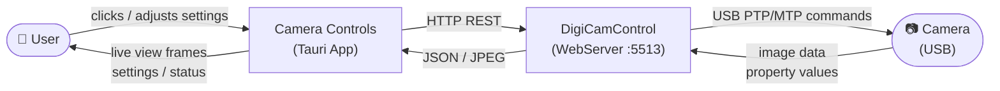
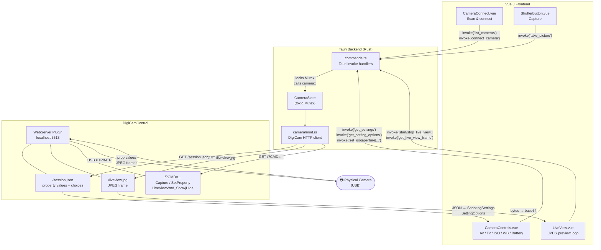
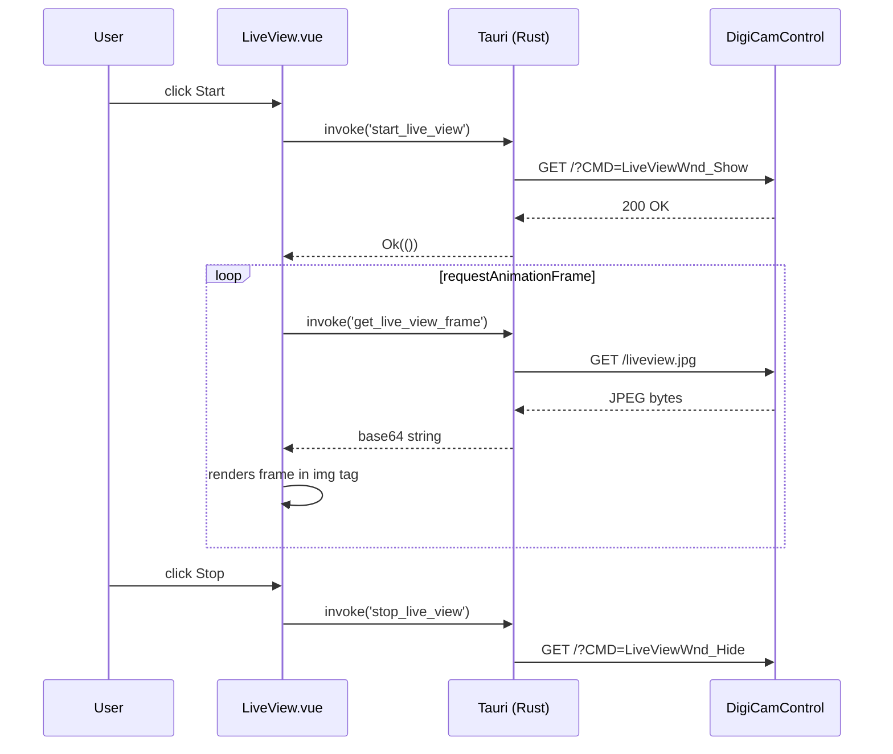
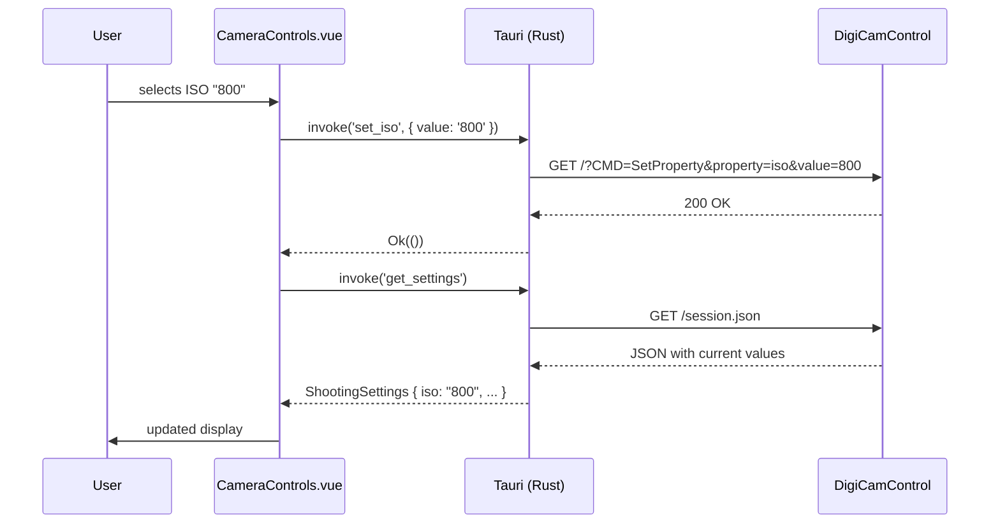

# Camera Controls

A desktop app built with **Tauri 2 + Vue 3** that remotely controls Canon/Nikon DSLR and mirrorless cameras over USB via **DigiCamControl** — no proprietary SDK installation required.

---

## Features

- **Camera Discovery** — lists all cameras detected by DigiCamControl
- **Aperture (Av)** — live selector synced from the camera
- **Shutter Speed (Tv)** — live selector synced from the camera
- **ISO** — live selector synced from the camera
- **White Balance** — all WB modes
- **Battery indicator** — live percentage bar
- **Shutter trigger** — single capture
- **Live View** — real-time JPEG preview polled from the camera

---

## How it Works — Data Flow Diagrams

### Context Diagram (Level 0)



### Application Flow (Level 1)



### Live View Frame Loop



### Settings Change Flow



---

## Installation

---

### For End Users (Running the App)

> If you just want to use the app, follow these steps. No Rust or Node.js required.

**Step 1 — Install DigiCamControl**

1. Download from **https://digicamcontrol.com/download** and run the installer.
2. Open DigiCamControl, go to **Extra → Plugins**, and enable **WebServer**.
3. Restart DigiCamControl. The web server auto-starts on `http://localhost:5513`.
4. Connect your camera via USB and power it on.

**Step 2 — Install Camera Controls**

1. Go to the [**Releases**](../../releases) page of this repository.
2. Download the latest `.msi` (Windows Installer) or `.exe` (NSIS) from the assets.
3. Run the installer and follow the prompts.
4. Launch **Camera Controls** from the Start Menu or Desktop shortcut.
5. Click **Scan** — your camera will appear if DigiCamControl is running.

> **Tip:** DigiCamControl must be running with the WebServer plugin active whenever you use this app.

---

### For Developers (Building from Source)

### Prerequisites

| Requirement | Version | Link |
|-------------|---------|------|
| Node.js | ≥ 18 | https://nodejs.org |
| Rust & Cargo | stable | https://rustup.rs |
| DigiCamControl | ≥ 2.1 | https://digicamcontrol.com |
| WebView2 Runtime | any | Pre-installed on Windows 10/11 |

> **Note:** No Canon/Nikon SDK download is required. DigiCamControl handles all USB communication.

---

### Step 1 — Install DigiCamControl

1. Download the installer from https://digicamcontrol.com/download
2. Run the installer and complete setup.
3. Open DigiCamControl.
4. Go to **Extra → Plugins** and enable **WebServer**.
5. Restart DigiCamControl — the web server starts automatically on `http://localhost:5513`.
6. Connect your camera via USB and power it on. It should appear in DigiCamControl's device list.

### Step 2 — Install Rust

```powershell
# Download and run rustup-init.exe from https://rustup.rs
# Or via winget:
winget install Rustlang.Rustup
```

After install, open a new terminal and verify:

```powershell
rustc --version   # rustc 1.xx.x
cargo --version   # cargo 1.xx.x
```

### Step 3 — Install Node.js

```powershell
winget install OpenJS.NodeJS.LTS
```

Verify:

```powershell
node --version    # v18.x.x or higher
npm --version
```

### Step 4 — Clone & Install dependencies

```powershell
git clone https://github.com/your-username/Camera-Controls.git
cd Camera-Controls
npm install
```

### Step 5 — Run in development mode

Make sure DigiCamControl is running with the WebServer plugin active, then:

```powershell
npm run tauri dev
```

The app window will open. Click **Scan** to discover connected cameras.

### Step 6 — Build a distributable installer

```powershell
npm run tauri build
```

The installer is output to `src-tauri/target/release/bundle/`.

---

## Project Structure

```
Camera-Controls/
├── src/                          # Vue 3 frontend
│   ├── App.vue                   # Root layout & global state
│   └── components/
│       ├── CameraConnect.vue     # Scan & connect to camera
│       ├── CameraControls.vue    # Av / Tv / ISO / WB / Battery
│       ├── ShutterButton.vue     # Capture trigger
│       └── LiveView.vue          # Live JPEG preview loop
│
├── src-tauri/                    # Tauri / Rust backend
│   ├── src/
│   │   ├── camera/
│   │   │   └── mod.rs            # DigiCamControl HTTP client
│   │   ├── commands.rs           # Tauri invoke() command handlers
│   │   ├── lib.rs                # App entry-point & state setup
│   │   └── main.rs               # Binary entry-point
│   ├── libs/                     # Empty — no SDK files needed
│   ├── build.rs                  # Tauri build script
│   ├── Cargo.toml                # Rust dependencies
│   └── tauri.conf.json           # Window & bundle config
│
├── index.html
├── vite.config.js
└── package.json
```

---

## Recommended IDE Setup

[VS Code](https://code.visualstudio.com/) with these extensions:

- [Vue - Official](https://marketplace.visualstudio.com/items?itemName=Vue.volar)
- [Tauri](https://marketplace.visualstudio.com/items?itemName=tauri-apps.tauri-vscode)
- [rust-analyzer](https://marketplace.visualstudio.com/items?itemName=rust-lang.rust-analyzer)

---

## Supported Cameras

DigiCamControl supports 700+ camera models. See the full compatibility list at:
https://digicamcontrol.com/cameras

Broadly: Canon EOS (DSLR + mirrorless), Nikon DSLR, and select Sony/Olympus bodies.
